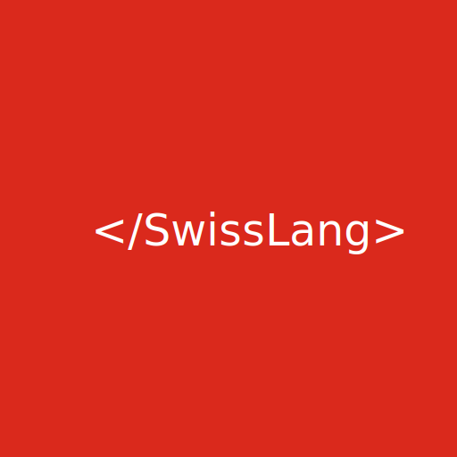

<!-- _coverpage.md -->

# SwissLang <small>0.1</small>

> The swiss programming language.

- Simple and lightweight
- Swiss German 😄

[GitHub](https://github.com/riesenacht/SwissLang)
[Get Started](#swisslang-definition)

<!-- Background Color -->

